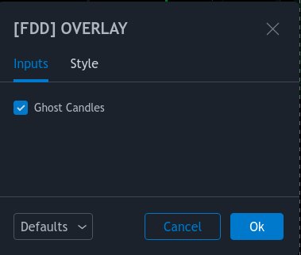
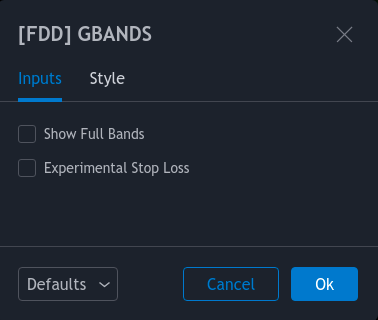
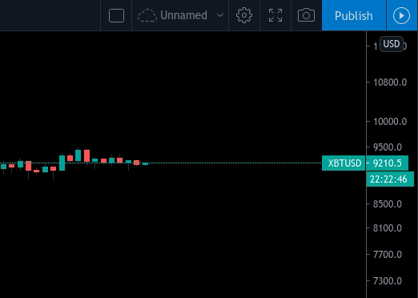
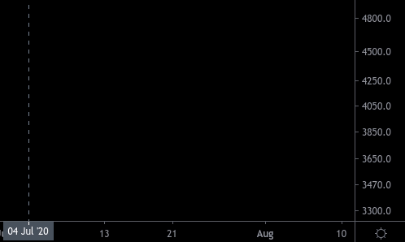
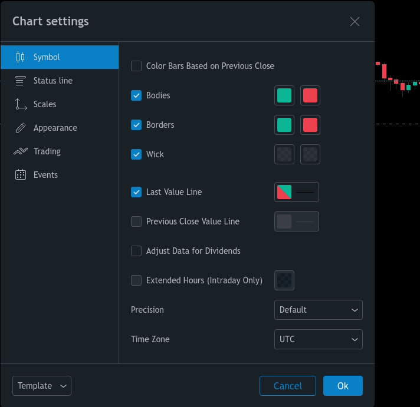
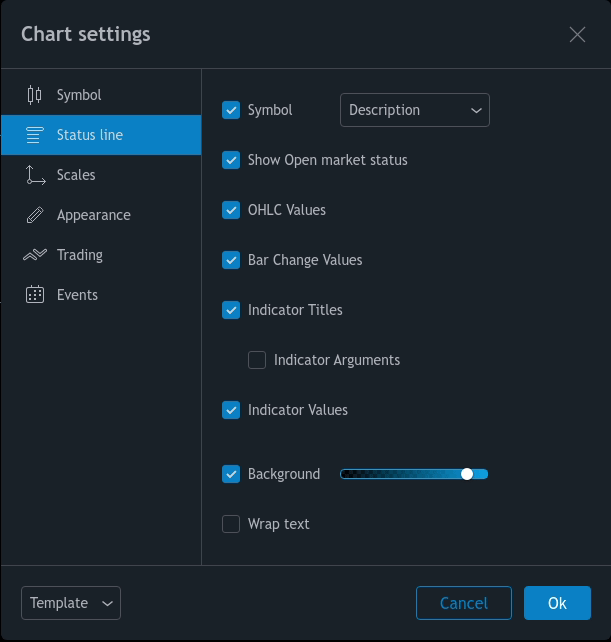
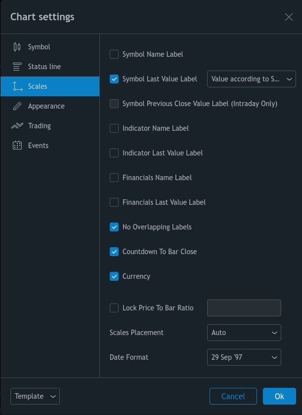
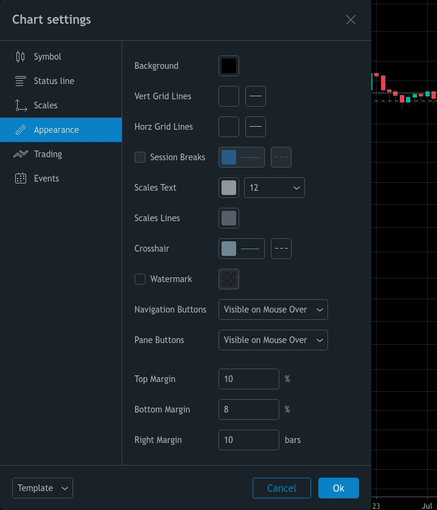
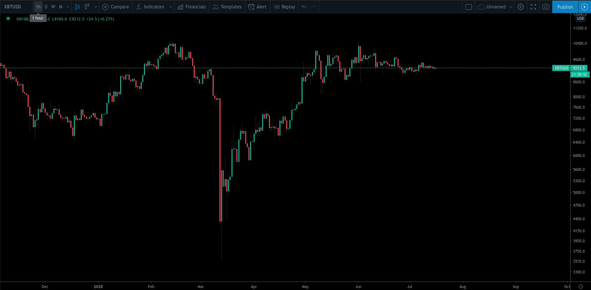
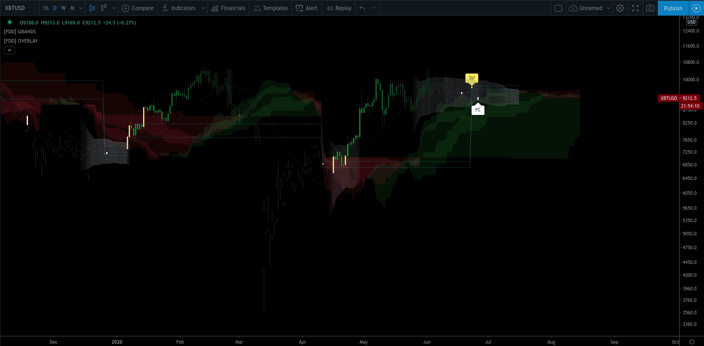

# Fomo Driven Development Strategy Overlay


[Main Strategy Overlay](#fdd-strategy-overlay-overview)

[FDD Ghost Bands](#fdd-ghost-bands-overview)

[Setup Guide](#setup-guide)

[Setup Alerts](#setup-alerts)

[Candle Legend](#candle-legend)

[Contact Information](#contact-information)


## FDD Strategy Overlay Overview

TODO: Write overview

[FDD] Strategy Overlay Options


---

## FDD Ghost Bands Overview
[FDD] Ghost Bands indicator is a low volatility squeeze indicator.  Its goals are to visualize periods of low volatility and stay subtle enough to layer on top of other strategy overlays and not add too much clutter.  These periods of low volatility will sometimes contract to a narrow channel, which can lead to a breakout in price action.  However, the indicators job is not to determine the direction of the price breakout.

[FDD] Ghost Bands Options

* Show Full Bands – This will show the full bands including areas of volatility that did not meet the low volatility threshold.

* SL Label – This is an experimental stop loss feature.  It uses anomalies detected in low to high and high to low volatility transitions to show points, which may be useful as exits. It is experimental and it may get you stopped out too early.  It is omnidirectional and most useful when you are already in a nice long or short trend and need a hint to take some profits off the table.  WARNING this is an experimental feature and you may not want to be too strict with using it as an exit, it will get you out too early from time to time.



---
## Setup Guide

Create a **New Chart Layout**.



Open **Chart settings**.



Under Chart settings  **Symbol**

* Uncheck borders.
* Turn both Wick colors to gray with an Opacity of 66%.



Under Chart settings **Status line**

* Uncheck Symbol
* Uncheck Indicator Values
* Uncheck Background



Under Chart settings **Scales**

* Check Symbol Name Label



Under Chart settings  **Appearance**

* Turn the background color to black
* Change the Vert Grid Lines and Horz Grid Lines opacity to 0%



Add the **Indicators** to the chart

Under the Invite-only scripts

* Add FOMO DRIVEN DEVELOPMENT GHOST BANDS V2
* Add FOMO DRIVEN DEVELOPMENT OVERLAY



Create an Indicator **Template**

TODO: explaination on what a template is.




---

## Candle Legend

---

## Setup Alerts

---

## Contact Information

Twitter = Telegram = Tradingview = Discord = @dgnsrekt

Email = dgnsrekt@pm.me

```

                        .-._                                                   _,-,
                         `._`-._                                           _,-'_,'
                            `._ `-._                                   _,-' _,'
                               `._  `-._        __.-----.__        _,-'  _,'
                                  `._   `#==="""           """===#'   _,'
                                     `._/)  ._               _.  (\_,'
                                      )*'     **.__     __.**     '*(
                                      #  .==..__  ""   ""  __..==,  #
                                      #   `"._(_).       .(_)_."'   #
 /$$$$$$$$ /$$$$$$  /$$      /$$  /$$$$$$        /$$$$$$$  /$$$$$$$  /$$$$$$ /$$    /$$ /$$$$$$$$ /$$   /$$
| $$_____//$$__  $$| $$$    /$$$ /$$__  $$      | $$__  $$| $$__  $$|_  $$_/| $$   | $$| $$_____/| $$$ | $$
| $$     | $$  \ $$| $$$$  /$$$$| $$  \ $$      | $$  \ $$| $$  \ $$  | $$  | $$   | $$| $$      | $$$$| $$
| $$$$$  | $$  | $$| $$ $$/$$ $$| $$  | $$      | $$  | $$| $$$$$$$/  | $$  |  $$ / $$/| $$$$$   | $$ $$ $$
| $$__/  | $$  | $$| $$  $$$| $$| $$  | $$      | $$  | $$| $$__  $$  | $$   \  $$ $$/ | $$__/   | $$  $$$$
| $$     | $$  | $$| $$\  $ | $$| $$  | $$      | $$  | $$| $$  \ $$  | $$    \  $$$/  | $$      | $$\  $$$
| $$     |  $$$$$$/| $$ \/  | $$|  $$$$$$/      | $$$$$$$/| $$  | $$ /$$$$$$   \  $/   | $$$$$$$$| $$ \  $$
|__/      \______/ |__/     |__/ \______/       |_______/ |__/  |__/|______/    \_/    |________/|__/  \__/

FOMO DRIVEN DEVELOPMENT [Filter > Entry > Exit > Timing > Survial]
DGNSREKT (2020)
```
